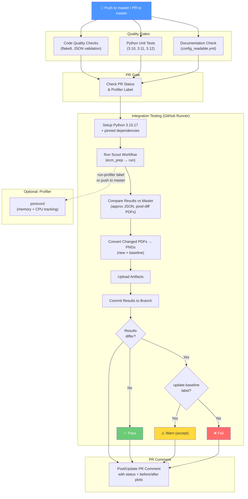

# CI/CD Pipeline

## Workflow Overview

## How It Works

### Triggers
- **Push to `master`**: Runs full pipeline including profiler
- **PR to `master`**: Runs on `opened`, `synchronize`, `reopened`, `ready_for_review`, `labeled`

### Comparison Strategy
- **JSON results**: Approximate comparison — values within `0.0001%` tolerance are treated as equal (handles floating-point platform noise)
- **PDF plots**: Rendered to PNG at 150 DPI and compared pixel-by-pixel — metadata-only differences (timestamps, version strings) are ignored
- **Summary Excel files**: Percent difference report generated for review

### When Results Differ
1. Results are committed to the PR branch and uploaded as artifacts
2. Before/after plot images are embedded in the PR comment
3. The integration test step fails with ❌

### Accepting Expected Changes
1. Add the `update-baseline` label to the PR
2. CI re-runs automatically (via `labeled` trigger)
3. The failure step is skipped — results are accepted as the new baseline
4. When merged, the committed results become the master baseline

### Pinned Environment
- Python `3.10.17` + `.github/constraints.txt` with exact dependency versions
- `SOURCE_DATE_EPOCH=0` for deterministic PDF timestamps
