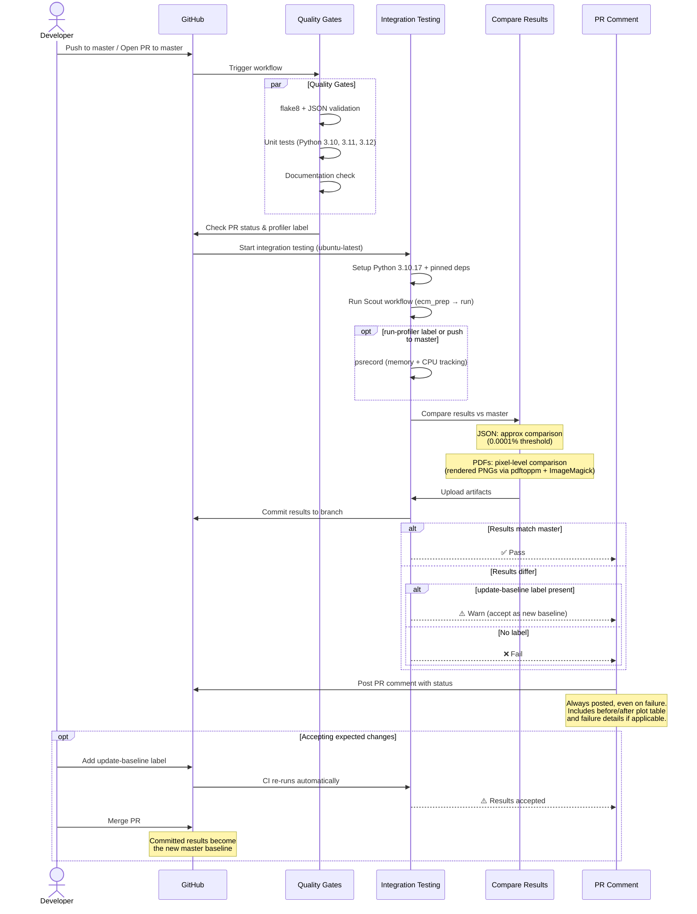

# CI/CD Pipeline

## Workflow Sequence

## How It Works

### Triggers
- **Push to `master`**: Runs full pipeline including profiler
- **PR to `master`**: Runs on `opened`, `synchronize`, `reopened`, `ready_for_review`, `labeled`

### Comparison Strategy
- **JSON results**: Approximate comparison — values within `0.0001%` tolerance are treated as equal (handles floating-point platform noise)
- **PDF plots**: Rendered to PNG at 150 DPI and compared pixel-by-pixel — metadata-only differences (timestamps, version strings) are ignored
- **Summary Excel files**: Percent difference report generated for review

### When Results Differ
1. Results are committed to the PR branch and uploaded as artifacts
2. Before/after plot images are embedded in the PR comment
3. The integration test step fails with ❌

### PR Comment
- A PR comment is **always posted** after every CI run, regardless of pass/fail status
- On failure, the comment includes a "Failure Details" section explaining the cause
- On diff failures, the comment includes instructions to use the `update-baseline` label
- Changed plots are shown in a before/after table inside collapsible sections

### Accepting Expected Changes
1. Add the `update-baseline` label to the PR
2. CI re-runs automatically (via `labeled` trigger)
3. The failure step is skipped — results are accepted as the new baseline
4. When merged, the committed results become the master baseline

### Pinned Environment
- Python `3.10.17` + `.github/constraints.txt` with exact dependency versions
- `SOURCE_DATE_EPOCH=0` for deterministic PDF timestamps

### Cross-Platform Testing
- Integration tests also run on **Windows** and **macOS** to verify cross-platform compatibility
- Comparison/commit/comment logic only runs on Ubuntu (the baseline environment)

## How to Use CI Flags

### PR Labels

| Label | Effect |
|---|---|
| `run-profiler` | Enables memory and CPU profiling during the integration test |
| `update-baseline` | Accepts result diffs as expected changes (skips failure step) |

### Adding a Label
1. Go to the PR page on GitHub
2. Click the **Labels** gear icon in the right sidebar
3. Select the desired label (create it first if it doesn't exist)
4. CI re-runs automatically when the label is added (via the `labeled` trigger)

### Profiler
When enabled (via `run-profiler` label or push to `master`), the profiler:
- Tracks memory and CPU usage via `psrecord`
- Runs each step (`ecm_prep`, `run`) individually with `--with_profiler`
- Generates `profile_*.csv` files with peak memory/CPU metrics
- Logs are included in the uploaded workflow artifacts

### update-baseline
Use this when code changes intentionally alter results:
1. Review the before/after plots in the PR comment
2. If the changes are expected, add the `update-baseline` label
3. CI re-runs and skips the failure step (emits a warning instead)
4. On merge, the committed results become the new master baseline

### Constraints File
To update pinned dependency versions:
1. Edit `.github/constraints.txt` with the new versions
2. Re-run CI to verify the integration test still produces matching results
3. If results differ, use `update-baseline` to accept the new baseline
