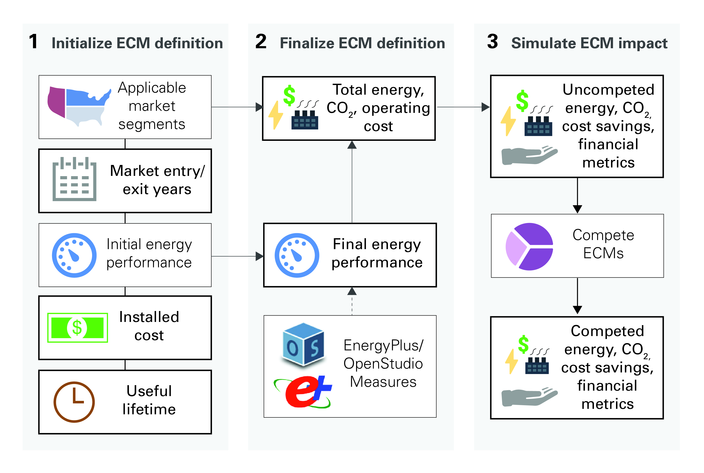
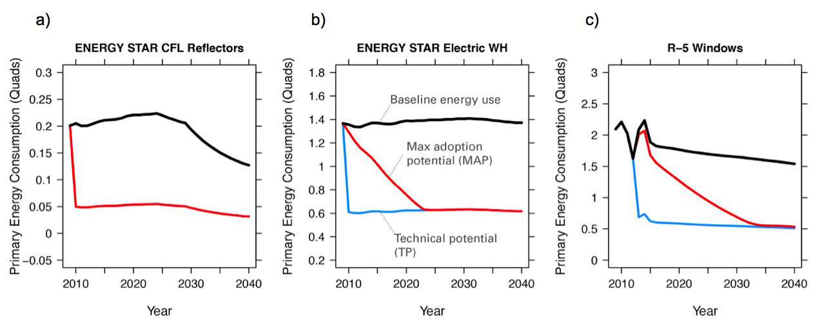

.. _analysis-approach:

Scout Analysis Approach
=======================

A full analysis in Scout has three primary steps, shown with some additional detail in :numref:`scout-overview`.

1. Develop an initial ECM definition.
2. Finalize ECM definition by retrieving additional performance and market data.
3. Simulate ECM impact across multiple adoption scenarios, with and without ECM competition.

.. _scout-overview:

   Scout ECM analyses require establishing an initial ECM definition; finalizing the ECM definition through integration of additional performance data and retrieval of baseline and efficient energy, carbon, and cost markets; and simulating ECM impacts with and without competition among ECMs considered.

.. _analysis-step-1:

Step 1: Develop initial ECM definition(s)
-----------------------------------------

Users may define entirely new ECMs or modify existing ECM definitions located in the "ecm_definitions" directory. Each Scout ECM definition centers around seven user-specified attributes. Three of these seven attributes -- energy efficiency, installed cost, and lifetime -- may be assigned a probability distribution [#]_ instead of a point value; these attributes also require source information from the user. 

.. _ecm-sources:

Acceptable sources for ECM input definitions include: RSMeans_ (for installed cost); databases from EIA_, `ENERGY STAR`_, and national labs; peer-reviewed journal publications or reports; and product literature.

.. Acceptable sources for ECM input definitions include: RSMeans_ (for installed cost); `EnergyPlus/OpenStudio`_ (for energy efficiency, see :ref:`step 2 <analysis-step-2>`); databases from EIA_, `ENERGY STAR`_, and national labs; peer-reviewed journal publications or reports; and product literature.

Selections for the applicable baseline market parameters are used in :ref:`step 2 <analysis-step-2>` to retrieve total energy use, |CO2|, and operating cost data for the baseline market. The ECM can then be applied to that baseline market to calculate savings impacts. The specific values available for all of the applicable baseline market parameters are included in the :ref:`ecm-applicable-baseline-market` section.

.. _RSMeans: https://www.rsmeans.com/
.. _EnergyPlus/OpenStudio: http://apps1.eere.energy.gov/buildings/energyplus/
.. _EIA: https://www.eia.gov/analysis/studies/buildings/equipcosts/
.. _ENERGY STAR: https://www.energystar.gov/products/energy_star_most_efficient
.. _national labs: http://www.nrel.gov/ap/retrofits/

.. _Building America climate zones: http://apps1.eere.energy.gov/buildings/publications/pdfs/building_america/ba_climateguide_7_1.pdf
.. _AIA climate zones: https://www.eia.gov/consumption/residential/reports/images/climatezone-lg.jpg
.. _three residential: http://www.eia.gov/forecasts/aeo/assumptions/pdf/residential.pdf
.. _eleven commercial: http://www.eia.gov/forecasts/aeo/assumptions/pdf/commercial.pdf
.. _AEO: https://www.eia.gov/analysis/studies/buildings/equipcosts/pdf/full.pdf

.. _ecm-contents:

* Applicable baseline market parameters

   * Climate zone (correspond to the five `AIA climate zones`_).
   * Building type (correspond to `three residential`_ and `eleven commercial`_ building types used in the EIA Annual Energy Outlook (AEO)).
   * Building vintage ("new" and/or "existing").
   * Fuel type ("electricity", "natural gas", "distillate", or "other").
   * End use (correspond to the major residential__ and commercial__ energy end uses defined in the AEO).
   * Technology name (for envelope components, technology names correspond to the names of residential__ and commercial__ thermal load components; for building equipment, technology names generally correspond to major equipment types used in the AEO_ [#]_).

.. anonymous links for the multiple cases of "residential" or "commercial" as the link text
.. __: https://www.eia.gov/forecasts/aeo/data/browser/#/?id=4-AEO2016&cases=ref2016~ref_no_cpp&sourcekey=0
.. __: https://www.eia.gov/forecasts/aeo/data/browser/#/?id=5-AEO2016&cases=ref2016~ref_no_cpp&sourcekey=0
.. __: https://github.com/trynthink/scout/blob/master/1999%20Residential%20heating%20and%20cooling%20loads%20component%20analysis.pdf
.. __: https://github.com/trynthink/scout/blob/master/1999%20Commercial%20heating%20and%20cooling%20loads%20component%20analysis.pdf

* Market entry and exit year                                

   * Market entry year reflects the first year the ECM is commercially available, while market exit year typically reflects a future efficiency standard that would render the ECM obsolete. 

* Energy efficiency                                        

   * Energy efficiency is specified at the unit level in absolute terms (e.g., U-value and solar heat gain coefficient for a window, or COP for a heat pump) using the :ref:`required units <ecm-performance-units>` or as a percentage relative savings value. 

..   * Relative savings percentages can be drawn from results of EnergyPlus/OpenStudio simulations. In such cases, the user flags the use of EnergyPlus/OpenStudio results in the energy efficiency input definition, and these results are filled in as part of :ref:`step 2 <analysis-step-2>` of the ECM analysis process.

* Installed cost

   * Product or technology :ref:`installed cost <first-ecm-installed-cost>` should be specified in absolute (not incremental) terms.
   * Cost units vary by building sector and technology type, as specified in the :ref:`ECM Definition Reference <ecm-installed-cost-units>`.

* Lifetime

   * Expected lifetime of the ECM in years.

* Additional ECM features

   * Is the ECM a service add-on or replacement?

      * ECMs may either directly replace the service of a comparable "business-as-usual" technology (e.g., a more efficient air source heat pump) or enhance the efficiency of this incumbent technology (e.g., a window film or HVAC controls retrofit).  
      * The choice of whether an ECM is of the "replacement" or "add-on" type has implications for cost calculations. In the former case, the ECM's incremental installed cost is calculated relative to that of the comparable baseline unit; in the latter case, the baseline cost is zero and the ECM's incremental installed cost is equal to its installed cost.

   * Does the ECM require fuel switching?

      * In cases where an ECM has a different fuel type than a comparable "business-as-usual" technology (e.g., an electric cold climate heat pump replacing a gas furnace for heating service), the user must specify the fuel type switched to (e.g., "electricity").

.. _analysis-step-2:

Step 2: Finalize ECM definition
-------------------------------

ECM definitions from :ref:`step 1 <analysis-step-1>` are finalized using the "ecm_prep.py" script. The total (stock-wide) energy use, |CO2| emissions, and operating costs of the ECM are calculated for baseline and efficient cases, not accounting for ECM competition.

.. ECM definitions from :ref:`step 1 <analysis-step-1>` are finalized in two ways using the "ecm_prep.py" script: 1) ECM energy efficiency is updated with results from EnergyPlus/OpenStudio simulations, and 2) the total (stock-wide) energy use, |CO2| emissions, and operating costs of the ECM are calculated for baseline and efficient cases, without accounting for ECM competition. Note that the former is only required when a user has flagged EnergyPlus/OpenStudio as the source of energy efficiency data in :ref:`step 1 <analysis-step-1>`.

.. _OpenStudio Measures: http://nrel.github.io/OpenStudio-user-documentation/getting_started/about_measures/
.. _EnergyPlus whole building energy simulation engine: https://energyplus.net/
.. _commercial reference building models: http://energy.gov/eere/buildings/commercial-reference-buildings
.. _on GitHub: https://github.com/NREL/OpenStudio-PTool/tree/master/design_docs

.. analysis-step-2-energyplus: (CONVERT BACK TO SECTION REFERENCE TAG)

.. Finalizing ECM efficiency input via EnergyPlus/OpenStudio
   ~~~~~~~~~~~~~~~~~~~~~~~~~~~~~~~~~~~~~~~~~~~~~~~~~~~~~~~~~

.. * Scout ECMs applicable to commercial buildings can be represented as `OpenStudio Measures`_ and simulated with the `EnergyPlus whole building energy simulation engine`_. EnergyPlus is capable of representing detailed heating, cooling, lighting, and other energy uses in buildings; it is thus well suited to represent ECMs that may affect energy use across multiple end uses (e.g., advanced envelope materials that affect both heating and cooling loads; high efficiency lighting that reduces cooling loads and increases heating loads; integrated heat pumps that save heating, cooling, and water heating energy; and building controls that save heating, cooling, lighting, and/or plug load energy).
   * OpenStudio Measures are applied to 16 `commercial reference building models`_ across five building vintages [#]_ and eight Building America climate zones [#]_.
   * Measure energy use outputs are specified by climate zone, building type, building vintage, fuel type, and end use. By comparing Measure energy use outputs against the energy use outputs of an equivalent baseline model with no Measures applied and mapping OpenStudio building types and vintages to those of Scout, relative energy savings percentages can be calculated and then used to specify a Scout ECM's energy efficiency.  
   * An initial set of OpenStudio Measures for Scout is under active development `on GitHub`_.  

.. _Annual Energy Outlook (AEO) reference case: https://www.eia.gov/forecasts/aeo/tables_ref.cfm

Calculating total baseline energy, |CO2|, and cost (uncompeted)
~~~~~~~~~~~~~~~~~~~~~~~~~~~~~~~~~~~~~~~~~~~~~~~~~~~~~~~~~~~~~~~

   * Total uncompeted energy use, |CO2| emissions, and operating cost baselines are calculated for each ECM from a _`2010-2040 projection` of U.S. building stock, energy use, and unit characteristics. These baseline data are mostly drawn from the inputs and outputs of the EIA `Annual Energy Outlook (AEO) reference case` simulations. [#]_ Where AEO data are not available, such as for building envelope component and electronics technologies, BTO develops original datasets using multiple sources external to DOE.

      * Baseline stock data represent the total number of units of a certain incumbent or "business-as-usual" technology associated with a given baseline market and year in the projection period. An example is the number of air-source heat pump units in all existing single family homes in mixed dry climates in the year 2020. When a number of units value is not available or not applicable for a baseline market, such as for building envelope component technologies, total building floor area square footage associated with that baseline market and year is used to quantify the baseline stock.
      * Baseline energy use data represent the total energy use attributed to a certain baseline market and year in the projection period. For example, the energy used to provide heating in all existing single family homes in mixed dry climates in the year 2031.
      * Baseline technology characteristics data represent the primary attributes of an incumbent or "business-as-usual" building technology, namely the technology's energy efficiency (in absolute units, e.g., COP), installed cost, and lifetime. Additionally, these data include consumer choice parameters for each technology, which are used for ECM competition (see :ref:`step 3 <analysis-step-3>`).

   * Once baseline energy use numbers are established for each technology, these energy use numbers must be translated from site to source (or "primary") energy using site-source conversion factors calculated from the electricity and electricity related losses data in the `AEO energy consumption by sector and source table`_. `Fuel-specific energy costs`_ and |CO2| emission intensities, calculated by dividing fuel-specific |CO2| emissions_ by fuel-specific `energy use`_, are also derived from AEO summary tables. |CO2| emissions costs are drawn from the most recent U.S. Office of Management and Budget `Social Cost of Carbon`_ estimates [#]_.

.. _energy use: 
.. _AEO energy consumption by sector and source table: http://www.eia.gov/forecasts/aeo/data/browser/#/?id=2-AEO2016&region=1-0&cases=ref2016&start=2013&end=2040&f=A&sourcekey=0
.. _Fuel-specific energy costs: http://www.eia.gov/forecasts/aeo/data/browser/#/?id=3-AEO2016&region=1-0&cases=ref2016&start=2013&end=2040&f=A&sourcekey=0
.. _emissions: http://www.eia.gov/forecasts/aeo/data/browser/#/?id=17-AEO2016&cases=ref2016~ref_no_cpp&sourcekey=0
.. _stocks-and-flows: https://en.wikipedia.org/wiki/Stock_and_flow

.. ADD LINK TO FIRST BULLET IN THIS SECTION WITH FURTHER DETAILS REGARDING THE DEVELOPMENT OF ORIGINAL DATASETS TO AUGMENT THE AEO DATA
.. ADD LINK TO THE JSON FILE ONCE IT IS ADDED TO THE REPO

Calculating total efficient energy, |CO2|, and cost (uncompeted)
~~~~~~~~~~~~~~~~~~~~~~~~~~~~~~~~~~~~~~~~~~~~~~~~~~~~~~~~~~~~~~~~

   * Total uncompeted energy use, |CO2|  emissions, and operating cost baselines calculated for an ECM from the input data are used to generate the total uncompeted energy use, |CO2| emissions, and operating costs with the ECM implemented - hereby referred to as the "efficient" case - as follows:

      * calculate an efficient energy fraction for the ECM; this is the fraction of per unit energy use under a full ECM implementation compared to the per unit energy use of a baseline case with no ECM implementation,
      * multiply the efficient energy fraction by the ECM's total baseline energy use to yield an efficient energy use total, and
      * use the ECM's total efficient energy use to calculate its total efficient |CO2| emissions and operating costs, using |CO2| emission intensities, fuel-specific energy cost data, and the `Social Cost of Carbon`_.  

   * The magnitude of the difference between an ECM's total baseline and efficient energy, |CO2|, and operating costs depends on what portion of the ECM's baseline market it can affect in each year of the projected time period. This available market portion is determined by `stocks-and-flows`_ in the baseline markets over time. The primary stock-and-flow variables accounted for in Scout are listed here.

      * Stock variables (measured at a point in time, i.e., in a given year)

         * Competed stock – defined as the number of technology units that are new or up for retrofit/replacement in a given year.
         * Non-competed stock – defined as the number of existing technology units not up for retrofit/replacement.

      * Flow variables (measured over a period of time, i.e., from year to year)

         * New additions – defined as the technology units associated with new building construction; it is a fraction of the total existing technology units, determined by the ratio of new buildings to total buildings (residential) or new square footage to total square footage (commercial). The NEMS residential__ and commercial__ sub-module documentation outlines the derivation of the new and total buildings stock and square footage data.
         * Retrofits – defined as the technology units up for replacement before the end of their useful lifetime; it is a fraction of the total existing technology units, determined based on available literature on typical residential__ and commercial__ building equipment retrofit rates.
         * Replacements – defined as the technology units at the end of their useful lifetime; it is a fraction of the total existing technology units, determined by 1/lifetime of the existing technology, excepting technical potential cases (see next bullet).

.. __: http://www.eia.gov/forecasts/aeo/nems/documentation/residential/pdf/m067(2013).pdf
.. __: http://www.eia.gov/forecasts/aeo/nems/documentation/commercial/pdf/m066(2013).pdf
.. __: http://www.raponline.org/wp-content/uploads/2016/05/rap-neme-residentialefficiencyretrofits-2011-05.pdf
.. __: http://www.rmi.org/Knowledge-Center/Library/2010-11_WholeBuildingRetrofits

   * _`ECM diffusion` into baseline markets is modeled under technical potential and maximum adoption potential scenarios. In both cases, the available market portion is entirely captured by ECMs (e.g., no competed stock remains with a "business-as-usual" technology). [#]_ The primary difference between the two scenarios is in how they define competed stock for the first year of ECM market entry:

      * in the technical potential case, an ECM competes for all new and existing stock in its market entry year, while 
      * in the maximum adoption potential scenario, an ECM competes for all new stock and existing stock that is up for retrofit or replacement in its market entry year.   

   * Under these two scenarios, the portions of a baseline market that are captured by an ECM never return to a "business-as-usual" technology option. In a technical potential case, this means the complete market saturation an ECM secures upon market entry is sustained across the entire projection period.
   * Because baseline markets are comprised mostly of existing stock (typically 97% or more in each year) and existing stock retrofit rates are low (less than 2% in each year), the market diffusion of an ECM in a maximum adoption potential scenario is mostly driven by existing stock replacement rates. As shown in the maximum adoption scenario results of :numref:`ecm-diffusion-example`, replacement of technologies with short lifetimes yields immediate market saturation for an ECM (:numref:`ecm-diffusion-example`\ a) and no difference between the technical potential and maximum adoption potential scenario results, while replacement of technologies with moderate to long lifetimes yields more gradual diffusion of an ECM into its baseline market (:numref:`ecm-diffusion-example`\ b and :numref:`ecm-diffusion-example`\ c).

.. _ecm-diffusion-example:

   Scout ECMs are applied to a baseline energy market under two technology diffusion scenarios: maximum adoption and technical potential. In a maximum adoption case, diffusion rates depend on realistic rates of new construction and retrofits in a given year, as well as the rate of turnover in the existing baseline equipment that an ECM could replace. The three ECMs shown represent (from left to right) fast, moderate, and slow diffusion rates under a maximum adoption scenario.

   * While the total baseline and efficient ECM energy, |CO2|, and operating costs calculated in this step account for stocks-and-flows, they do not account for competition across multiple ECMs for the same baseline market. ECM competition is handled in :ref:`step 3 <analysis-step-3>`.

Once user ECM definitions have been finalized in this step, the names of the ECMs are added to "run_setup.json," which contains a list of active ECM names to analyze in :ref:`step 3 <analysis-step-3>`. Users may choose to analyze only a subset of these existing ECMs by moving the names of ECMs that are not of interest in their analysis from the "active" to "inactive" lists in the "run_setup.json" file. For example, such ECM subsets might exclude "add-on" ECMs, ECMs that involve fuel switching, or ECMs based on prospective cost or efficiency targets. Users may also run the "run_setup.py" module, which can automatically move ECMs based on keyword searches of ECM names, as well as select ECMs based on the user's desired climate zone(s), building type(s), and structure type(s).

.. _analysis-step-3:

Step 3: Simulate ECM impact
---------------------------

The final step, contained in the "run.py" module, calculates each ECM's total energy savings, avoided |CO2| emissions, and operating cost savings impacts based on the total uncompeted energy use, |CO2| emissions, and operating costs calculated in :ref:`step 2 <analysis-step-2>`. Cost savings impacts are used to calculate per-unit financial metrics for the ECMs. Here, both competed and uncompeted ECM impacts and financial metrics are calculated. 

Calculating uncompeted ECM energy savings and financial metrics
~~~~~~~~~~~~~~~~~~~~~~~~~~~~~~~~~~~~~~~~~~~~~~~~~~~~~~~~~~~~~~~

* Uncompeted ECM energy savings, avoided |CO2| emissions, and operating cost savings impacts are calculated by subtracting the total uncompeted efficient energy, |CO2|, and operating costs calculated in :ref:`step 2 <analysis-step-2>` from total uncompeted baseline energy, |CO2|, and operating costs calculated in :ref:`step 2 <analysis-step-2>`. Note that each of these total figures are calculated for technical potential and maximum adoption potential scenarios, and therefore ECM impacts and financial metrics are also described in terms of these scenarios.

* ECM _`financial metrics` are calculated by normalizing ECM savings impacts to the total number of stock units and comparing unit savings to the ECM's incremental capital cost over the comparable "business-as-usual" technology.

   * Consumer-level metrics are relevant to building owners making ECM adoption decisions. These metrics remain unchanged following ECM competition.

      * Internal Rate of Return (IRR) is the discount rate that balances the net present value of the ECM cost (negative cash flow) against the savings realized by the ECM on a per-unit basis (positive effective cash flow). 
      * Simple Payback Period divides the per-unit cost of the ECM by its per-unit annual energy savings compared to the "business-as-usual" unit.

   * Uncompeted portfolio-level metrics are relevant to organizations evaluating large portfolios of ECMs. The values for these metrics change as total (portfolio-wide) energy/|CO2|/cost savings impacts are reduced following :ref:`ECM competition <ECM-competition>`. 

      * Cost of Conserved Energy (CCE) divides the per-unit cost of the ECM by its discounted [#]_ per-unit lifetime savings compared to the "business-as-usual" unit. In one variant of the CCE calculation, discounted lifetime cost savings from avoided |CO2| emissions are added to the numerator of the calculation, using `Social Cost of Carbon`_ estimates as a carbon tax.    
      * Cost of Conserved |CO2| (CCC) follows the same calculation as CCE, but uses avoided |CO2| emissions in the denominator and energy cost savings in the numerator (if applicable).

.. _ECM-competition:

Competing ECMs and updating savings and financial metrics
~~~~~~~~~~~~~~~~~~~~~~~~~~~~~~~~~~~~~~~~~~~~~~~~~~~~~~~~~

* ECMs with overlaps in their applicable baseline markets compete for the overlapping portions of these markets on the basis of their cost effectiveness from a consumer perspective. In general, ECMs with lower incremental capital costs and higher operational cost savings across their lifetimes capture larger portions of the overlapping baseline markets.
* For example, R-5, R-7, or R-10 window ECMs could each replace the same "business-as-usual" window technology. The initial savings impacts calculated for each of these ECMs will be based on the entire applicable baseline market. Those savings impacts must be scaled by the share of the baseline window market each ECM is modeled as capturing to avoid double counting of savings. Assuming the R-7 window is most cost effective and R-10 is least cost effective, the market shares might be R-5, 35%; R-7, 45%; and R-10, 20%.
* This use of market shares to reflect ECM competition ensures that competing ECMs with similar levels of cost effectiveness will have similar savings impacts after adjusting for competition.
* In general, ECM competition calculations in Scout weigh an ECM's annualized capital and operating costs against the capital and operating costs for competing ECMs to determine each ECM's competed market share. However, the specific calculation steps differ somewhat between the residential and commercial building sectors.
* Once ECM market shares are determined, uncompeted ECM savings impact estimates are multiplied by these market shares to arrive at competed ECM energy savings, avoided |CO2| emissions, and operating cost savings impacts. 
* For heating and cooling ECMs, a post-competition calculation is needed to ensure that total supply-side heating/cooling energy use (e.g., as consumed by a heat pump, or furnace) equals total demand-side heating/cooling energy use (e.g., that attributable to heat transfer through the envelope and other thermal load components). 
* Competed ECM savings impacts are used to calculate competed portfolio-level financial metrics (CCE, CCC). This calculation proceeds exactly as described earlier for uncompeted portfolio-level metrics, but with total savings impacts numbers adjusted to reflect ECM competition outcomes.

.. IN BULLET 4, ADD LINK TO COMPETITION CALCULATION DETAILS FOR RESIDENTIAL AND COMMERCIAL

ECM-specific results from the analysis of the portfolio of ECMs
~~~~~~~~~~~~~~~~~~~~~~~~~~~~~~~~~~~~~~~~~~~~~~~~~~~~~~~~~~~~~~~

* Filter variables summarize an ECM's applicable climate zone(s), building class(es), and end use(s). 
* Baseline and efficient results summarize an ECM's total baseline and efficient energy use, |CO2|, emissions and operating costs, as well as the savings realized by comparing the efficient case to the baseline case. Baseline and efficient results  are reported as totals for the ECM and also broken down by building sector (residential/commercial), climate zone, and end use [#]_.
* Financial metrics summarize an ECM's consumer and portfolio-level `financial metrics`_.
* Average and 5th/95th percentile values are reported for all efficient markets, savings, and financial metrics outputs to accommodate ECM input uncertainty analysis.

.. _ASHRAE 90.1-2004: https://www.ashrae.org/resources--publications/bookstore/standard-90-1-document-history
.. _ASHRAE 90.1-2010: https://www.ashrae.org/resources--publications/bookstore/standard-90-1-document-history
.. _ASHRAE 90.1-2013: https://www.ashrae.org/resources--publications/bookstore/standard-90-1-document-history
.. __: http://www.eia.gov/forecasts/aeo/nems/documentation/residential/pdf/m067(2013).pdf
.. __: http://www.eia.gov/forecasts/aeo/nems/documentation/commercial/pdf/m066(2013).pdf
.. _real discount rate: https://en.wikipedia.org/wiki/Real_interest_rate
.. _DOE Quadrennial Technology Review: http://energy.gov/sites/prod/files/2015/09/f26/Quadrennial-Technology-Review-2015_0.pdf
.. _Guidelines and Discount Rates for Benefit-Cost Analysis of Federal Programs: https://www.whitehouse.gov/sites/default/files/omb/assets/a94/a094.pdf

.. rubric:: Footnotes

.. [#] Currently supported distributions: |supported-distributions|.
.. [#] Note that this document does not cover lighting, where varying bulb types are used, or Miscellaneous Electric Loads (MELs), which are not broken into specific technologies in the Annual Energy Outlook.
.. [#] The vintages are: pre-1980, 1980-2004, `ASHRAE 90.1-2004`_, `ASHRAE 90.1-2010`_, and `ASHRAE 90.1-2013`_.
.. [#] A representative city is simulated for each climate zone: Houston, TX (hot humid); Baltimore, MD (mixed humid); El Paso, TX (hot dry); Albuquerque, NM (mixed dry); San Francisco, CA (marine); Chicago, IL (cold); Duluth, NM (very cold), Fairbanks, AK (sub arctic).
.. [#] EIA provides detailed documentation on the assumptions of the National Energy Modeling System (NEMS) it uses to project residential__ and commercial__ sector energy use out to 2040 for the AEO.
.. [#] Data derived from Table A1, assuming a 3% average discount rate.
.. [#] This assumption reflects our current inability to reliably determine how a consumer might choose between an ECM and updated version of a "business-as-usual" technology. A future version of Scout may apportion some of an available market portion to this updated "business-as-usual" technology, under an "Adjusted Adoption Potential" scenario.
.. [#] We use a default `real discount rate`_ of 7%, based on the Office of Management and Budget's `Guidelines and Discount Rates for Benefit-Cost Analysis of Federal Programs`_, p. 9 ("Base-Case Analysis"). 
.. [#] End use categories for the markets and savings are not the same as the AEO end uses. These end use categories are similar to the 2015 `DOE Quadrennial Technology Review`_, Figure 5.1, but with the "Drying" end use lumped together with "Other."